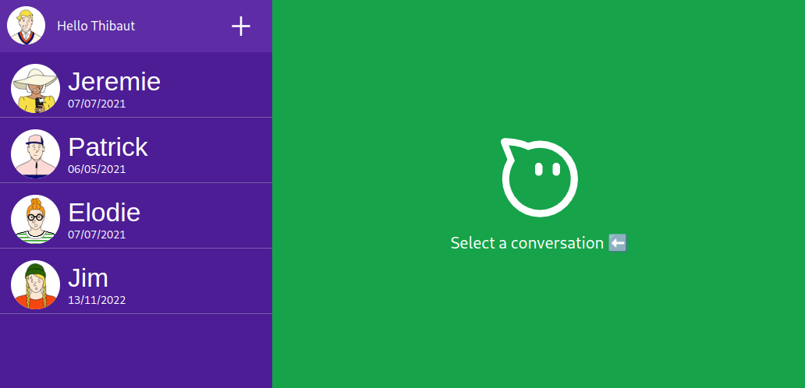
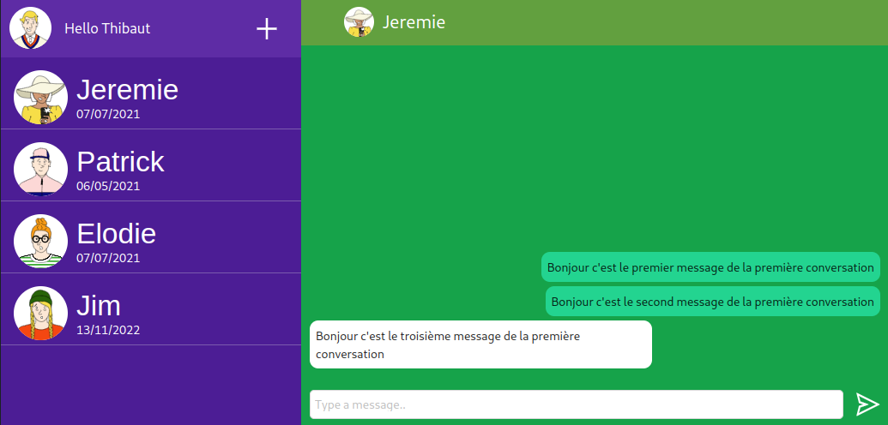

Hi,

_If you need to change the current user, you may click on the avatar on the top left of the screen._
About the time spend on the project, it's around 8 hours.

I have started by cloning the repository on my computer, then I read the instructions and what was already setup.

Then I've been thinking about the UI, the layout and how to organise the conversion list with the messages.
I wanted something similar to the WhatsApp web version:


It means a left side-bar and the current conversation on the right.

## Setup

I set up in first place different libraries to help me during the code process:

1. classnames
2. sass
3. tailwind css (finally not used much)
3. antd
4. axios
5. react-query

## Layout

My first problematic was to adapt the side-bar (conversations container, left part) with the current conversation (
right panel).

I have started to create both component on mobile version, I didn't use the router for the first version, but used it
later.
At the beginning I just used the default page to display the current conversation with an animation.
With the userContext to share the current conversation selected, then the `conversationWrapper` display from it.

## Tests

I created four tests to show different tests I could create with my components, see the `ConversationElement` component.

The actual test step on CI does not work because I have a snapshot test who does not render the same date on my
computer.
I could extract the way the date is created within a function and mock it with `jest.mock()`.
I will be sure to have always the same format for the date in the test step.

## Create a new conversation

During the process of creating the new conversation, I decided to create a new route `pages/contact` with
a random list of contact, where user will be able to create a new conversation.
In same time I refactored the conversation system by adding the conversation page to the router to replace the system
context explained previously.

I updated the server to support the creation of a conversation.
I had troubles with the server not reading the last entries in the database, when creating a new conversation
between two users.
I tried to use:

```js
const dbPath = `${path.dirname(__filename)}/../db.json`
const router = jsonServer.router(dbPath)
```

and I finally make it works with `db.read()`, first system was not able to fetch new data from json file.

## Style

I used my basic colors for the layout and help me to make the difference between the components, it could be improved,
but I cannot spend more time on it.

## Previews





